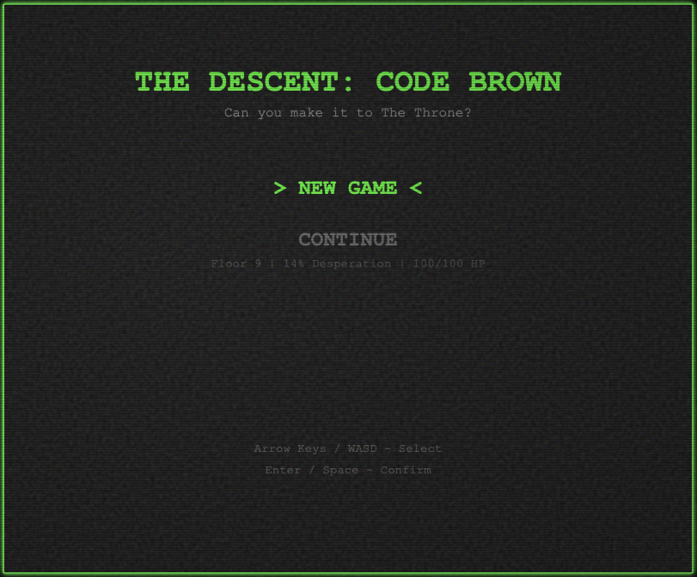
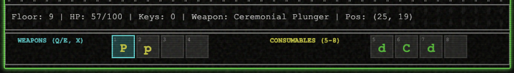
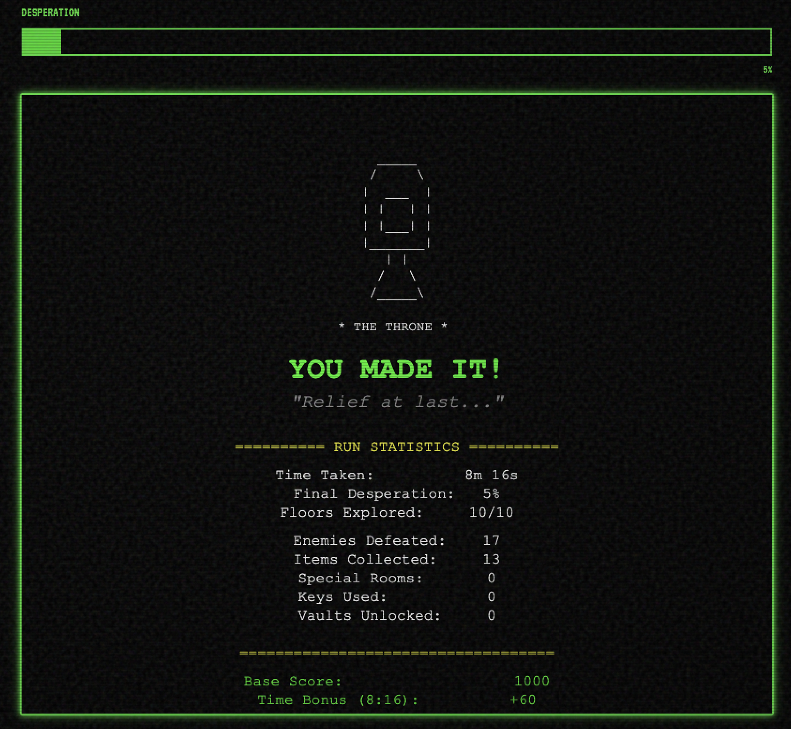

# The Descent: Code Brown

> A desperate ASCII roguelike adventure through 10 floors of corporate chaos


## 🎮 Play Now

**Browser-based** - No installation required. Just open `index.html` in your browser!

Race through 10 floors of ChromaCorp Tower to reach the only working bathroom. Manage your rising desperation, fight enemies, find items, and use your "Clench" ability strategically. Can you make it before time runs out?

## 🎯 Features

- **⭐ Signature Clench Mechanic** - Press C to freeze desperation for 10 seconds (60s cooldown) - THE defining feature
- **💪 Desperation-Based Abilities** - Bash through weak walls at 75%, force locked doors at 90%
- **🧟 7 Enemy Types** with tactical AI - Security Bots, Coffee Zombies, Janitors, Gremlins, Rats, Pipe Monsters, The Desperate
- **⚔️ 10 Weapons + 4 Consumables** - Plunger, TP Launcher, Fire Extinguisher, Wrench, Energy Drinks, Coffee, and more
- **🎲 Procedural Dungeon Generation** - Every run is unique with themed floors (Office, Maintenance, Sewer)
- **🛋️ Break Room Safe Zones** - Desperation pauses inside (floors 8-3)
- **🕊️ Shrine Altars** - Press R to restore HP and reduce desperation
- **🎒 Dual Inventory System** - Separate weapon and consumable slots with Q/E cycling
- **🏆 Victory Scoring System** - 6 ranks from "Legendary Holder" to "Next Time, Skip Lunch"
- **💾 Save/Continue System** - Resume anytime (permadeath on death/victory)
- **📖 Full Tutorial** - Press H in-game for complete guide with 4 tabs
- **🎵 16 Sound Effects** - Procedural audio with M key mute toggle
- **🎨 Professional CRT Effects** - Scanlines, phosphor glow, VT323 terminal font

## 🕹️ Controls

| Action | Keys |
|--------|------|
| **Move** | `WASD` or `Arrow Keys` |
| **Attack** | `SPACE` |
| **Clench** | `C` (freeze desperation 10s) |
| **Cycle Inventory** | `Q` / `E` |
| **Select Weapon** | `1-4` |
| **Select Consumable** | `5-8` |
| **Use Consumable** | `ENTER` |
| **Drop Item** | `X` |
| **Restore at Shrine** | `R` (when on shrine Ω) |
| **Read Lore** | `R` (when on feature *) |
| **Help** | `H` |
| **Mute/Unmute** | `M` |
| **Pause** | `P` |

## 📖 How to Play

1. **Start:** You begin on Floor 10 of ChromaCorp Tower with a CODE BROWN emergency
2. **Descend:** Fight through procedurally generated floors to reach Floor 1
3. **Manage Desperation:** Your desperation meter constantly rises at 0.35%/sec
4. **Use Clench Strategically:** Press C to freeze desperation for 10 seconds (60s cooldown)
5. **Fight Enemies:** 7 enemy types with unique behaviors and tactical AI
6. **Collect Items:** 10 weapons and 4 consumables with strategic effects
7. **Find Safe Zones:** Break Rooms on floors 8-3 pause desperation
8. **Desperation Powers:** Unlock abilities at high desperation (bash walls 75%, force doors 90%)
9. **Reach The Throne:** Find the toilet on Floor 1 to win!

### Desperation Thresholds

- **0-24% (Green):** Comfortable - No effects
- **25-49% (Yellow):** Urgent - Movement penalties begin
- **50-74% (Orange):** Critical - Rage mode combat (+damage, -accuracy)
- **75-89% (Red):** Desperate - Can bash through weak walls for shortcuts!
- **90-99% (Flashing Red):** EXTREME - Can force locked doors open!
- **100%:** Game Over - "You didn't make it..."

## 🎨 Screenshots

### Main Menu

*Professional CRT terminal aesthetic with boot sequence*

### Combat Action

*Tactical combat with desperation-based abilities*

### Inventory System

*Dual weapon/consumable slot management with tooltips*

### Victory Screen

*Victory scoring with 6 ranks and complete statistics*

## 🛠️ Tech Stack

- **Vanilla JavaScript** (ES6 modules, zero dependencies)
- **HTML5 Canvas** (ASCII rendering with phosphor CRT effects)
- **Web Audio API** (16 procedural sound effects)
- **localStorage** (save/continue system)
- **7,200+ lines of code** across 20 modular files

### Architecture Highlights

- Clean ES6 module system (renderer, player, input, combat, etc.)
- Procedural dungeon generation with pathfinding validation
- Entity-based design (player, enemies, items)
- Real-time game loop with tactical cooldowns
- Modular sound system with mute toggle
- Persistent save system with version checking

## 🚀 Local Development

```bash
# Clone repository
git clone https://github.com/[your-username]/the-descent-code-brown.git
cd the-descent-code-brown

# Serve locally (ES6 modules require HTTP server)
python3 -m http.server 8000
# or
npx http-server

# Open browser
open http://localhost:8000
```

### Development Commands

- No build step required (vanilla JS)
- No npm dependencies
- Just clone and serve!

## 🎮 Game Design Philosophy

This game started as a "zero-pressure fun project" built session-by-session over ~15 hours:

- **Core Premise:** Office worker racing to bathroom = relatable comedy
- **Signature Mechanic:** Clench ability = universally understood "holding it"
- **Desperation as System:** Not just flavor - affects movement, combat, and abilities
- **Risk/Reward:** High desperation = high power (but dangerous)
- **Strategic Depth:** Multiple playstyles viable (speed, combat, exploration)

The result: A comedic premise with serious roguelike depth.

## 📊 Game Statistics

- **10 floors** of procedurally generated dungeons
- **7 enemy types** - Security Bot, Coffee Zombie, Janitor, Gremlin, Rat, Pipe Monster, The Desperate
- **10 weapons** - Plunger, Toilet Brush, Wrench, Mop, TP Launcher, Stapler, Fire Extinguisher, Coffee Pot, Keyboard, Ceremonial Plunger
- **4 consumables** - Antacid, Coffee, Donut, Energy Drink
- **3 floor themes** - Office, Maintenance, Sewer
- **5 special room types** - Vault, Shrine, Break Room, Arena, Storage
- **6 victory ranks** - Legendary Holder → Next Time, Skip Lunch
- **~4-6 minute strategic runs** (0.35%/sec desperation rate)

## 🏆 Credits

**Developed by:** Phill Clapham ([phillipclapham.com](https://phillipclapham.com))
**Built with:** [Claude Code](https://claude.com/claude-code) - Session-based collaborative development

### Development Stats
- ~15 hours of focused sessions
- 19 major sessions across 4 development phases
- Zero pressure, maximum fun
- Built entirely browser-based with zero dependencies

## 📄 License

MIT License - see [LICENSE](LICENSE) file for details.

Free to use, modify, and distribute. Attribution appreciated!

## 🎯 Gameplay Tips

- **Clench is life** - Save it for desperate moments (75%+)
- **Break Rooms are strategic** - Plan your route through safe zones
- **High desperation = high power** - Don't fear 75%+ desperation
- **Shrines are clutch** - Use R on cyan Ω symbols to restore
- **Explore environmental features** - Blue * symbols have funny lore
- **Inventory management matters** - Q/E to cycle, X to drop unwanted items
- **Sound cues help** - M to unmute if you've muted
- **Pause to strategize** - P key pauses game for planning

## 🐛 Known Features

- **Konami Code Easter Egg** - Try ↑↑↓↓←→←→ Space Enter 😉

---

**"Hold it together. You can make it. Probably."**
